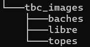

# STC-Classification
This repository corresponds to the Speed bumps, Potholes and Clear street multiclass classification.

##This repository has the aim to publish the multiclass code sample to train with an specific dataset:

[Speed bumps, Potholes and Clear street](https://drive.google.com/drive/folders/1ugaPdFtf5o2Wgreb2DTOBgVhdDk2uZAL)

### Steps TODO:
* Download the dataset
* Setup the dataset as shows:
	
* Train with 
	python multiarch_tbc.py
* Load model and classify with:
	python3.8 read_models_time.py
